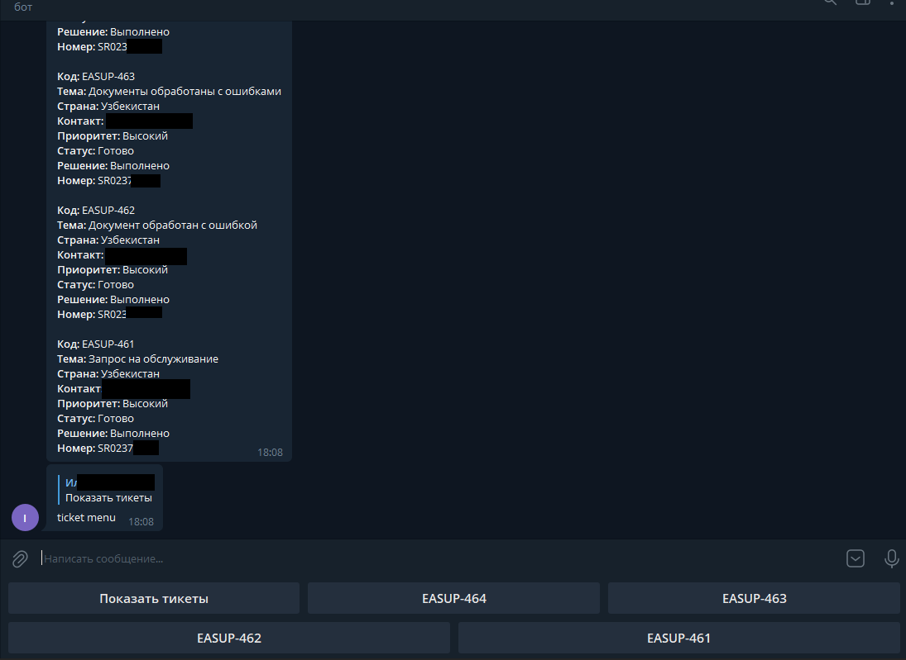

# JiraTelegramBotInformer

Телеграм бот для просмотра N-ого числа последних заявок в Jira. Выводит по умолчанию 4 последних тикета кратким списком,
после чего добавляются 4 кнопки с номерами тикетов, предоставляющие возможность получить более подробные сведения о 
каждом отдельном обращении. Присутствует функция уведомления о новых тикетах, ее можно включить и отключить.

### Быстрый старт

###### Установка
1. Скопировать репозиторий в удобное место.
2. Далее подразумевается что у Вас установлен [Python 3.8+](https://www.python.org/downloads/release/python-3813/)
и [pip](https://pip.pypa.io/en/stable/installation/). Запустить install.bat, он установит зависимости.
3. Создать своего Telegram Bot. 
* Найти [@BotFather](https://telegram.me/botfather).
* Выполнить /start, затем /newbot.
* Заполнить требующиеся данные и получить bot_token.

###### Запуск
1. В run_bot.bat указать полученный ранее token, а так же login и password от Jira, дополнительно можно указать 
количество получаемых тикетов и интервал опроса Jira.
2. Запустить run_bot.bat
3. Найти своего бота по ранее придуманному имени и выполнить /start.

###### Альтернативный запуск
Выполнить _python ./main.py -t token -l login -p password -c count_

###### Docker
- Docker multi-stage build project distroless. Size = 151MB.
 
- [DockerHub](https://hub.docker.com/repository/docker/palamiko/jira_telegram_bot_informer)
1. Создать файл env.list с содержимым, указав свои данные:
```
    TOKEN=token
    LOGIN=login
    PASSWORD=passwd
    COUNT=4
    INTERVAL=60
```
2. Запустить 
```
docker run --name task-informer --env-file ./env.list palamiko/jira_telegram_bot_informer
```
Для запуска в интерактивном режиме, с выводом консоли:
```
docker run --name task-informer -it --env-file ./env.list palamiko/jira_telegram_bot_informer
```

Для самостоятельной сборки image:
```
docker build -t my_name_image .
```

###### Команды бота
    '/s - Start' 
    '/h - Help, this message' 
    '/on - Notification about new task on.' 
    '/off - Notification about new task off.' 
    't - Show last task'


### Структура проекта
```
TaskInformerBot
|    install.bat
|    run_bot.bat
|    requirements.txt  #  Зависимости для работы бота
|    readme.md
|    main.py  #  Точка входа в приложение
|
|
└─── bot_app
|   |
|   └─── api
|   |    |    
|   |    |    bot_api.py  # Предоставляет методы для работы с Telegram.
|   |    |    jira_api.py  # Предоставляет методы для запросов в Jira.
|   |    
|   └─── models
|   |    |    
|   |    |    message_handler.py  # Вспомогательный класс для форматирования сообщений на вывод в Telegram.
|   |    |    tasks.py  # Модель сообщения получаемая от Jira.
|   |
|   └─── utils
|   |    |
|   |    |    config.py  # Парсер ключей запуска.
|   |    |    const  # Постоянные приложения.
|   |
|   └─── __init__.py  # Инициализирует модуль
|
└─── logs  
```

